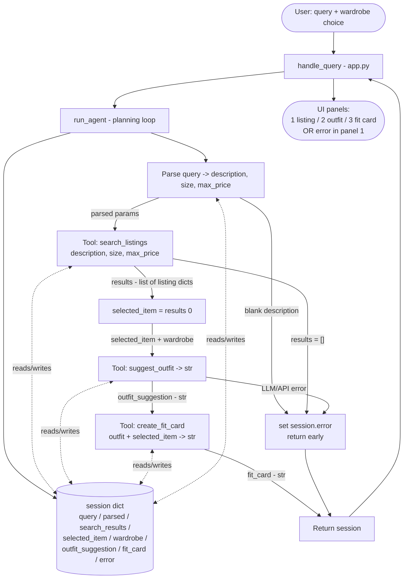

# FitFindr — planning.md

> Complete this document before writing any implementation code.
> Your spec and agent diagram are what you'll use to direct AI tools (Claude, Copilot, etc.) to generate your implementation — the more specific they are, the more useful the generated code will be.
> Your planning.md will be reviewed as part of your submission.
> Update it before starting any stretch features.

---

## Tools

List every tool your agent will use. For each tool, fill in all four fields.
You must have at least 3 tools. The three required tools are listed — add any additional tools below them.

### Tool 1: search_listings

**What it does:**
Searches the mock secondhand dataset (`data/listings.json`, loaded via `load_listings()`) for items that match the user's description, with optional size and price filters. It scores each candidate by keyword overlap with the description and returns the matches sorted best-first. This is a pure data-filtering tool — no LLM call.

**Input parameters:**
- `description` (str): Keywords describing the wanted item, e.g. `"vintage graphic tee"`. Required. Used for relevance scoring against each listing's `title`, `description`, and `style_tags`.
- `size` (str | None): Size to filter on, e.g. `"M"`. Optional — `None` skips size filtering. Matching is case-insensitive and substring-based so `"M"` matches `"S/M"` and `"M/L"`.
- `max_price` (float | None): Inclusive price ceiling, e.g. `30.0`. Optional — `None` skips price filtering. A listing passes if `listing["price"] <= max_price`.

**What it returns:**
A `list[dict]` of full listing dicts, sorted by relevance score descending (best match first). Each dict carries all eleven listing fields: `id`, `title`, `description`, `category`, `style_tags` (list[str]), `size` (str), `condition` (`"excellent"`/`"good"`/`"fair"`), `price` (float), `colors` (list[str]), `brand` (str | None), `platform` (`"depop"`/`"thredUp"`/`"poshmark"`). Listings that pass the size/price filters but score 0 on keyword overlap are dropped. Returns `[]` when nothing matches — it never raises.

**What happens if it fails or returns nothing:**
The function returns an empty list (it does not raise). The **agent** is responsible for the error path: when `search_results == []`, the planning loop sets `session["error"]` to a specific, actionable message (which filter was likely too strict and what to try) and returns early **without** calling `suggest_outfit`.

---

### Tool 2: suggest_outfit

**What it does:**
Given one thrifted item and the user's wardrobe, asks the Groq LLM to suggest 1–2 complete, wearable outfits that pair the new item with pieces the user already owns, naming specific wardrobe items.

**Input parameters:**
- `new_item` (dict): A single listing dict (the `selected_item` chosen from `search_listings` results). The LLM is told its `title`, `category`, `colors`, `style_tags`, and `condition` so the suggestion fits the actual piece.
- `wardrobe` (dict): A wardrobe dict shaped like `wardrobe_schema.json` — `{"items": [ {id, name, category, colors, style_tags, notes}, ... ]}`. May be empty (`{"items": []}`); the tool must handle that gracefully.

**What it returns:**
A non-empty `str` containing 1–2 outfit ideas in casual prose, e.g. *"Wear it with your baggy dark-wash jeans and chunky white sneakers; layer the vintage black denim jacket over top for a 90s streetwear look."* When `wardrobe["items"]` is empty, it instead returns general styling advice for the item (what categories/colors/vibes pair well) rather than referencing nonexistent pieces — still a non-empty string.

**What happens if it fails or returns nothing:**
Empty wardrobe is **not** a failure — it returns general advice. The agent only reaches this tool when `selected_item` is set, so `new_item` is always valid. If the LLM call raises (network/API key), the tool lets the exception propagate; the agent wraps the call in try/except, sets `session["error"]` to an LLM-unavailable message, and returns early without calling `create_fit_card`.

---

### Tool 3: create_fit_card

**What it does:**
Turns the outfit suggestion plus the item details into a short, casual, shareable caption — the kind of thing posted under an OOTD photo on Instagram/TikTok.

**Input parameters:**
- `outfit` (str): The outfit suggestion string returned by `suggest_outfit`. Required and must be non-empty.
- `new_item` (dict): The same `selected_item` listing dict, so the caption can name the item, price, and platform naturally (once each).

**What it returns:**
A 2–4 sentence `str` caption that feels authentic, mentions the item name + price + platform once each, captures the outfit vibe in concrete terms, and varies between runs (generated with a higher LLM temperature). Example: *"found this faded vintage band tee on depop for $19 🖤 styling it with my baggy jeans + chunky sneakers, full look soon."*

**What happens if it fails or returns nothing:**
If `outfit` is empty or whitespace-only, the tool returns a descriptive error **string** (it does not raise) so the UI always has something to show. The agent also guards: it only calls `create_fit_card` when `outfit_suggestion` is a non-empty string.

---

### Additional Tools (if any)

None for the core build. (Stretch idea: a `parse_query` LLM tool to extract `description`/`size`/`max_price` from free text — for the core build this parsing lives inline in the planning loop, see below.)

---

## Planning Loop

**How does your agent decide which tool to call next?**

The loop is deterministic and linear with two early-exit branches. It runs inside `run_agent(query, wardrobe)` and mutates one `session` dict (from `_new_session`).

1. **Init.** `session = _new_session(query, wardrobe)`.
2. **Parse query → `session["parsed"]`.** Extract `description`, `size`, `max_price` from the free-text query. `max_price` comes from a regex on `$NN` / `under NN`; `size` from a regex for `size X` or a standalone token like `M`/`S`/`L`/`XL` / a US shoe size; `description` is the leftover keywords with the price/size phrases stripped out. Store as `{"description": ..., "size": ... or None, "max_price": ... or None}`.
   - **Branch A (empty query):** if `description` is blank after parsing, set `session["error"] = "Tell me what you're looking for — e.g. 'vintage graphic tee under $30, size M'."` and `return session`.
3. **Search.** `results = search_listings(parsed["description"], parsed["size"], parsed["max_price"])`; store in `session["search_results"]`.
   - **Branch B (no results):** `if not results:` set `session["error"]` to a specific message naming the likely-too-strict filter (price/size/keywords) and `return session` early. **Do not** call `suggest_outfit`.
4. **Select.** `session["selected_item"] = results[0]` (top-scored match).
5. **Suggest outfit.** `session["outfit_suggestion"] = suggest_outfit(selected_item, session["wardrobe"])`, wrapped in try/except; on exception set `session["error"]` to an LLM-unavailable message and `return session`.
6. **Fit card.** Only if `outfit_suggestion` is a non-empty string: `session["fit_card"] = create_fit_card(outfit_suggestion, selected_item)` (also try/except guarded).
7. **Done.** `return session`. The interaction is complete when `fit_card` is set, or earlier when `error` is set. `error is None` ⇒ success; `error is not None` ⇒ early exit and downstream fields stay `None`.

The loop never re-orders or retries tools; the only decisions are the two `error` early-returns.

---

## State Management

**How does information from one tool get passed to the next?**

A single `session` dict (created by `_new_session`) is the single source of truth for one interaction; every step reads from and writes to it, so each tool's output becomes the next tool's input by being stored on the session.

Tracked fields and their flow:
- `query` (str) — original user text, set at init.
- `parsed` (dict) — `{description, size, max_price}` from the parse step; feeds `search_listings`.
- `search_results` (list[dict]) — output of `search_listings`; checked for emptiness (Branch B).
- `selected_item` (dict | None) — `search_results[0]`; passed into **both** `suggest_outfit` and `create_fit_card`.
- `wardrobe` (dict) — chosen by the UI (example vs. empty), set at init; passed into `suggest_outfit`.
- `outfit_suggestion` (str | None) — output of `suggest_outfit`; passed into `create_fit_card`.
- `fit_card` (str | None) — output of `create_fit_card`; final artifact shown to the user.
- `error` (str | None) — set on any early exit; `None` means success.

`run_agent` returns the whole session. `handle_query` in `app.py` checks `session["error"]` first: if set, it shows the error in panel 1 and blanks panels 2–3; otherwise it formats `selected_item` into the listing panel and shows `outfit_suggestion` and `fit_card` in panels 2 and 3. There is no state shared across interactions — each query gets a fresh session.

---

## Error Handling

For each tool, describe the specific failure mode you're handling and what the agent does in response.

| Tool | Failure mode | Agent response |
|------|-------------|----------------|
| search_listings | No results match the query (returns `[]`) | Stop the loop before `suggest_outfit`. Set a specific message naming the likely culprit and an alternative, e.g. *"No matches under $30 in size M. Want me to bump the budget to $40, drop the size filter, or try broader keywords like 'graphic tee'?"* Show it in panel 1; leave panels 2–3 empty. |
| suggest_outfit | Wardrobe is empty (`items == []`) | **Not treated as an error** — the tool returns general styling advice for the item ("pairs well with relaxed denim and chunky sneakers; leans 90s grunge"), and the loop continues to `create_fit_card` normally. (If instead the LLM call raises, catch it and set `session["error"] = "Couldn't reach the styling model — check your GROQ_API_KEY and try again."`) |
| create_fit_card | Outfit input is missing or incomplete (empty/whitespace `outfit`) | The agent never calls it with empty input (it guards on `outfit_suggestion`). As a backstop, the tool itself returns a descriptive string like *"Can't write a fit card without an outfit to describe — try the search again."* rather than raising, so the UI still renders something. |

---

## Architecture

Error branches (`ERR`) terminate the flow early: parsing a blank description and an empty `search_listings` result both jump straight to "return session," skipping every downstream tool. The dotted lines show that each step reads its inputs from and writes its outputs to the shared `session` state.

---

## AI Tool Plan

**Milestone 3 — Individual tool implementations:**

I'll use **Claude (Claude Code)** for all three tools, implementing and testing one at a time against its planning.md block.

- **search_listings:** Give Claude the *Tool 1* block (the three params, the scoring/return spec, the "returns `[]`, never raises" rule) plus the `load_listings()` docstring from `utils/data_loader.py`. Expected output: a pure-Python function that filters by `max_price` and case-insensitive substring `size`, scores remaining listings by keyword overlap across `title`/`description`/`style_tags`, drops score-0 items, and sorts descending. **Verify before trusting:** read the code to confirm it (a) uses all three params, (b) returns `[]` rather than raising on no match, (c) doesn't mutate the loaded data. Then run 3 queries — `"vintage graphic tee", "M", 30.0` (expect graphic/band tees, none over $30), `"combat boots", "8", None` (size filter works), and `"designer ballgown", "XXS", 5.0` (expect `[]`).
- **suggest_outfit:** Give Claude the *Tool 2* block plus the wardrobe schema. It calls the Groq client (`_get_groq_client`). Expected output: branches on empty `wardrobe["items"]`, formats wardrobe items into the prompt when present, returns a non-empty string. **Verify:** run once with `get_example_wardrobe()` (must name real wardrobe pieces) and once with `get_empty_wardrobe()` (must give general advice, never invent owned items, never return `""`).
- **create_fit_card:** Give Claude the *Tool 3* block. Expected output: guards empty `outfit` by returning an error string, otherwise builds a prompt with item name/price/platform + outfit and calls the LLM at higher temperature. **Verify:** call with a real outfit string (caption mentions name+price+platform once each, 2–4 sentences) and with `""` (returns the error string, no exception); call twice with the same input to confirm the caption varies.

**Milestone 4 — Planning loop and state management:**

I'll give **Claude** the *Planning Loop*, *State Management*, and *Architecture* (Mermaid) sections together, plus the `run_agent` TODO and `_new_session` from `agent.py`. Expected output: `run_agent` that inits the session, parses the query into `session["parsed"]`, calls the three tools in order, writes each result to its session field, and takes the two early-exit branches (blank description, empty `search_results`) exactly as specified — never calling `suggest_outfit` with empty input. **Verify before trusting:** trace the code against my diagram to confirm the early returns land in the right places and downstream fields stay `None` on error; then run `python agent.py`, which exercises the happy path (`"vintage graphic tee under $30"` → expect a found item, outfit, and fit card) and the no-results path (`"designer ballgown size XXS under $5"` → expect `session["error"]` set and `outfit_suggestion`/`fit_card` still `None`). Finally wire `handle_query` in `app.py` and confirm the example queries (including the deliberate no-results one) render correctly across the three panels.

---

## A Complete Interaction (Step by Step)

Write out what a full user interaction looks like from start to finish — tool call by tool call. Use a specific example query.

**What FitFindr needs to do (in my own words):**

FitFindr is a secondhand-shopping assistant that turns a casual style request into a concrete thrifted find plus a way to wear it. A user's request for an item triggers `search_listings` (filtering the mock listings on description, size, and price); the top returned listing triggers `suggest_outfit`, which styles that item against the user's wardrobe; and the resulting outfit triggers `create_fit_card` to write a short, shareable caption. If `search_listings` finds nothing, the agent stops and tells the user what to change about their query (loosen price, drop size, try different keywords) rather than passing empty input down the chain — and likewise it won't run `suggest_outfit` on missing input or `create_fit_card` on an empty outfit.

**Example user query:** "I'm looking for a vintage graphic tee under $30. I mostly wear baggy jeans and chunky sneakers. What's out there and how would I style it?"

**Step 1 — Parse + Search:**
`run_agent` inits the session, then parses the query into `parsed = {"description": "vintage graphic tee", "size": None, "max_price": 30.0}` (no size given, so size filtering is skipped). It calls `search_listings("vintage graphic tee", None, 30.0)`, which returns the graphic/band tees under $30 sorted by relevance — e.g. `lst_006` "Graphic Tee — 2003 Tour Bootleg Style" ($24, depop, good) and `lst_033` "Vintage Band Tee — Faded Grey" ($19, depop, fair). Stored in `session["search_results"]`.

**Step 2 — Select + Suggest outfit:**
`session["selected_item"] = search_results[0]` (the top-scored tee). The agent calls `suggest_outfit(selected_item, wardrobe)` with the example wardrobe and stores the string in `session["outfit_suggestion"]` — e.g. *"Pair it with your baggy dark-wash jeans and chunky white sneakers; throw the vintage black denim jacket over top for a 90s streetwear look."*

**Step 3 — Fit card:**
Because `outfit_suggestion` is non-empty, the agent calls `create_fit_card(outfit_suggestion, selected_item)` and stores it in `session["fit_card"]` — e.g. *"thrifted this bootleg graphic tee off depop for $24 and it's already my favorite 🖤 styled with my baggy jeans + chunky sneakers, full look in stories."*

**Error path:**
If Step 1's `search_listings` returns `[]` (e.g. the deliberate `"designer ballgown size XXS under $5"`), the agent sets `session["error"]` to a specific suggestion (*"No matches under $5 in size XXS — want me to raise the budget or open up the size?"*) and returns early. `suggest_outfit` and `create_fit_card` are never called, so `outfit_suggestion` and `fit_card` stay `None`.

**Final output to user:**
`handle_query` checks `session["error"]` (None here) and fills the three UI panels: **panel 1** the chosen listing (title, price, platform, condition), **panel 2** the wardrobe-based styling suggestion, **panel 3** the ready-to-post fit card. On the error path, panel 1 shows the adjust-your-search message and panels 2–3 are blank.
